# :computer: DICAS ALGORITMO COM VISUALG :computer:

​	**ALGORITMOS** são conjuntos de passos finitos e organizados que, quando executados, resolvem um determinado problema.

​	Nesse post colocarei algumas dicas que são importantes para o aprendizado de Algoritmo. Estou partindo do princípio de que vocês não tem nenhum conhecimento na área e na matéria. Então para quem já conhece pode parecer óbvio, mas lembre-se que ninguém nasceu sabendo e que não existe ser humano que possua conhecimento de tudo, portanto ensinar desde o comecinho é o ideal para entendimento de qualquer conteúdo. Um canal que assisto e ensina tudo bem explicado do Zero é o do Curso em Vídeo com o professor Gustavo Guanabara, material excelente que compartilharei com vocês ao longo das explicações e o link para assistir essas aulas gratuitas e fantásticas.  [Clique Aqui para acessar o Curso de Lógica de Programação - Curso em Vídeo - Gustavo Guanabara](https://www.youtube.com/watch?v=8mei6uVttho&list=PLHz_AreHm4dmSj0MHol_aoNYCSGFqvfXV)

​	Minhas dicas serão focadas para utilização de um software gratuito que me ajudou demais a entender mais sobre algoritmo e lógica de programação chamado VISUALG. [Clique Aqui para download gratuito do Programa VISUALG](https://sourceforge.net/projects/visualg30/) 

## Variável, Identificadores e Tipos

​	

​	**Variável** computacionalmente, representa uma **posição de memória**, possuindo **nome/identificador e tipo**, cujo **conteúdo pode variar** ao longo do tempo, durante a execução do programa, e embora possa **assumir vários valores**, só pode **ARMAZENAR somente um valor de cada vez.** O campo de declaração de variáveis no visual é abaixo do **VAR**. 

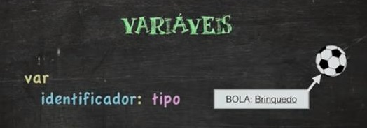

​	Os **identificadores ou nomes** das váriavéis devem seguir essas **6 regrinhas** conforme a imagem e é uma boa prática **nomear uma variável com o nome do que realmente vai representar para melhor compreensão de quem está interpretando o código**. Os tipos primitivos do visualg são **inteiro, real, caractere e lógico**. A nível de curiosidade, nas linguagens de programação os identificadores seguem essas regras também, por isso a importância de aprender essas regras. 

## Comandos de Saída ##

​	O comando de saída do visualg é o **escreva**, seguido de **parenteses e aspas** para escrever um **conjunto de caracteres que deseja exibir na tela **ou sem aspas caso queira mostrar **uma variável ou números**. Posso exibir **diversos conjuntos de caracteres e variáveis** em um **único escreva**, por exemplo, se tiver uma variável nome posso colocar para escrever assim: **escreva ("Muito prazer, ", nome)**, separados sempre por vírgula. O **escreval** no visualg é um comando para pular a linha após ele escrever o que está entre os parênteses.

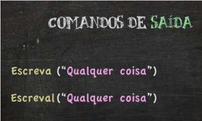

## Atribuição e Comando de Entrada

​	 O comando de **atribuição** é representado por uma **seta (<-)** que é lida por **recebe**. Utilizamos uma atribuição para uma variável receber um valor, uma conta, um nome, etc. Como vemos na imagem foi declarado uma variável chamada nome e que recebe Gustavo. Foi utilizado o comando de saída Escreva para exibir na tela Muito prazer, Gustavo. A nível de curiosidade, nas linguagens de programação utilizamos atribuições e geralmente elas são representadas pelo símbolo de =

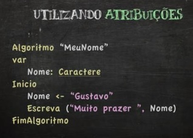

​	O comando de entrada é representado no visualg por **leia** que permite um “diálogo com o computador”, **armazenando** em sua memória um **valor a uma variável**. Como vemos na imagem foi declarado uma variável chamada nome e foi solicitado ao usuário que ele armazene seu nome a essa variável. Foi utilizado o comando de saída Escreva para exibir na tela Muito prazer, Nome (aparecerá o nome que o usuário digitar).

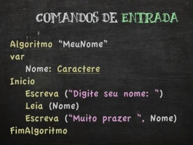

## Operadores Aritméticos

​	Os operadores aritméticos são basicamente os mesmo que são conhecidos na matemática, representados com os símbolos na primeira coluna da imagem. Uma **atenção** especial para a **divisão inteira (\)** que irá apresentar a **parte inteira** de uma **divisão** mesmo ela apresentando um resultado real. E ao **módulo (%)**, que será muito utilizado em alguns exercícios, representando o **resto da divisão**, que no exemplo é o número 1, pois 5 dividido por 2 resulta em uma divisão inteira 2 com resto 1.

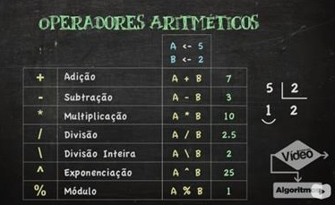

## Funções Aritméticas

​ Funções aritméticas são funções matemáticas que nos ajudam a resolver um cálculo mais complexo. A nível de curiosidade possuímos funções aritméticas nas linguagens de programação e a forma de utilizá-las varia de sintaxe, porém geralmente utilizam a biblioteca Math, importando dessa biblioteca essas funções.

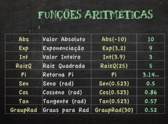

## Operadores Relacionais

​	São muito utilizados nos códigos e nos algoritmos, sendo de extrema importância entender sua aplicação. Geralmente utilizamos os operadores relacionais para testar uma condição (veremos isso adiante). Importante informar que a imagem mostra os operadores relacionais utilizamos no programa visualg e que para nível de curiosidade nos códigos de programação o igual é geralmente representado por == e o diferente por !=.

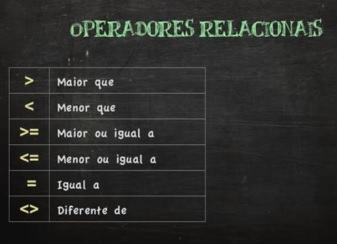

## Operadores Lógicos

​	Operadores lógicos são o **E, OU, NÃO** . Eles geram muitas dúvidas tanto na matemática quanto nos algoritmos porém eles são super simples de entender. 

​	Basta você pensar que o **E** é um operador **muito exigente, **para ele ficar feliz (ser verdade), **TODAS as condições devem ser verdadeiras**. A nível de curiosidade nas linguagens de programação o E é representado por &&.

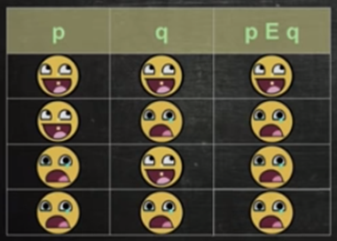

​	**OU** é um operador mais de boa, **mais “pode ser”** (lembrou da Pepsi né?), ou seja, se **pelo menos uma das condições forem verdadeiras ele fica feliz (ser verdade)**. A nível de curiosidade nas linguagens de programação o OU é representado por ||

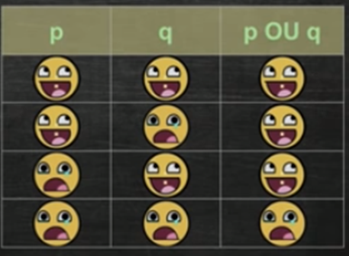

​	O operador **NÃO** é **sempre do contra**, se uma afirmação é verdadeira ele é falso e se uma afirmação é falsa ele é verdade. A nível de curiosidade nas linguagens de programação o NÃO é representado por !

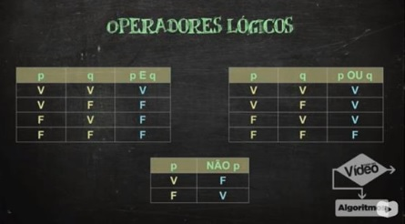

## Ordem de Precedência

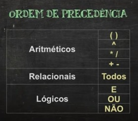

​	Ordem de precedência é a ordem de prioridade de resolução:

1° Resolve o que tiver entre parenteses;

2° Resolve as potências ou funções;

3° Resolve na ordem que aparecer a multiplicação e divisão;

4° Resolve na ordem que aparecer a soma e a subtração;

5° Resolve os relacionais que aparecerem (< , >, <=, >=, <>, =)

6° Resolve os operadores lógicos ( e, ou, não)

​	Pode parecer óbvio, mas muitas pessoas se confundem e acabam caindo nessas “pegadinhas” em questões de provas e concursos. Fiquem atentos! 

## Estrutura Condicional Simples

​	Estrutura **Condicional Simples** executa **um comando** ou **vários comandos** **se** a **condição** for **VERDADEIRA**. Se a condição for **FALSA**, a estrutura é **finalizada sem executar os comandos dentro do se**. Importante dizer, principalmente para quem está iniciando os estudos que é possível colocarmos o comando Se sem o senão. A nível de curiosidade o Se é uma estrutura muito utilizada nas linguagens de programação, sendo representadas por sua palavra em inglês if.

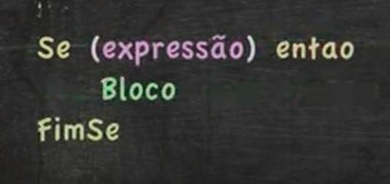

## Estrutura Condicional Composta

​	Estrutura Condicional Composta segue o mesmo princípio da Estrutura Condicional Simples, com a diferença de que quando a **condição não** é **satisfeita**, será **executado o outro comando dentro do bloco senão**. O comando que define a estrutura é representado pelas palavras **SE e SENÃO**. Nas estruturas **Se e Se/senao** no **visualg** será **necessário** colocar o **entao** após a condição e **finalizar** com o **FimSe** em cada Se que você iniciar. A nível de curiosidade as estruturas condicionais são muito utilizadas na programação, seja ela simples, composta ou aninhada (veremos a seguir) e é representado por suas palavra em inglês if/else.

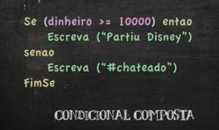

## Estrutura Condicional Aninhada

​	Estrutura Condicional **Aninhada** é **encadeamento de estruturas de decisão** em um algoritmo, ou seja, começa com uma condição e vai criando várias outras condições possíveis. Nessa estrutura é muito comum acharmos um Se dentro do outro, sendo necessário avaliar quando o Se será executado, para isso usamos a Indentação que irei comentar na próxima dica. É representado no visualg por se / senão se / senão, lembrando que a cada **se** que for colocado tem que fechar com **Fimse**. Esse Fimse que temos que colocar ao final de cada estrutura se é um treino para as linguagens de programação, onde teremos que abrir e fechar as chaves { } para cada bloco. A nível de curiosidade as estruturas condicionais aninhadas também são utilizadas com frequência nas linguagens de programação porém a sintaxe muda de linguagem para linguagem, por exemplo em python é utilizado if/elif/else e em outras como c#, java, por exemplo é utilizado if/else if/ else. 

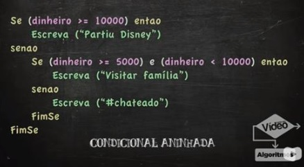

## Indentação

​	

​	A **indentação** em linguagem de programação é **digitação dos códigos** do programa **afastados **por **espaço da margem** e dispostos**hierarquicamente**, para **facilitar a visualização** e percepção do programa. Dessa forma conseguimos enxergar quando um Se será executado e qual será o próximo direcionamento. Devemos ir acostumando com a ideia de organizar o algoritmo, pois é um procedimento utilizado em todas as linguagens de programação. No visualg existe uma forma de deixar seu código indentado utilizando o comando **Ctrl + G** do teclado, porém aconselho a utilizar apenas no começo para ir se familiarizando com a indentação e aprendendo a ir fazendo. Um conselho é tentar fazer sozinho e depois selecionar o Ctrl + G para verificar se acertou. 

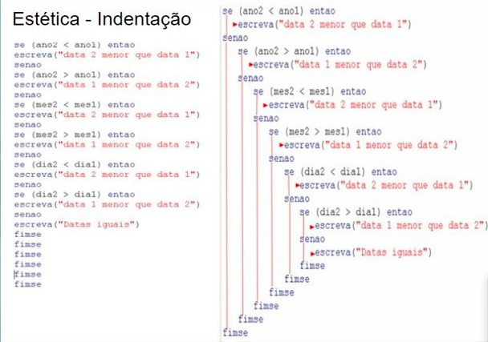

## Estrutura Escolha o Caso

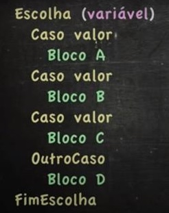

​	**ESCOLHA O CASO** é uma solução elegante quanto se tem várias **estruturas de decisão** (SE-ENTÃO-SENÃO) aninhadas e que só precisa ser igual a um determinado valor para executar aquele comando. A proposta da estrutura ESCOLHA-CASO é permitir ir direto no bloco de código desejado, dependendo do valor de uma variável de verificação. Exemplo: operação é uma variável que de acordo com o sinal (+ , - , * , /) que eu digitar ele irá executar o comando de cada operação. A nível de curiosidade utilizamos a estrutura escolha o caso com o seu nome em inglês nas linguagens de programação Switch case.

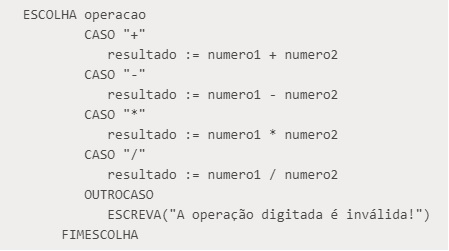

## Laços de Repetição

​	Laços de repetição, também conhecidos como laços de iteração ou simplesmente *loops*, são comandos que permitem iteração de código, ou seja, que comandos dentro do bloco sejam repetidos diversas vezes.

​	Assim como as demais estruturas, os laços de repetição são extremamente utilizados tanto nos algoritmos como nas linguagens de programação. Temos basicamente **três laços de repetição** sendo eles: **para** (conhecido na programação como for), **enquanto** (conhecido na programação como while) e **faça enquanto** (conhecido na programação como do while). 

​	Geralmente conseguimos resolver os exercícios de repetição com qualquer um dos três laços, porém é importante sabermos como cada um funciona pois existem exercícios que são mais apropriados utilizar uma estrutura do que a outra.

### Laço Para

​	O laço de repetição Para é o mais seguro de utilizar na minha opnião (pelo menos na fase que estamos aprendendo), pois dessa forma evitamos de esquecer os passos. Nesse laço somos obrigados a inicializar com três passos e sempre terá uma variável de controle, portanto atribuimos a essa variável por onde ela irá começar, o segundo passo é indicar o término dessa variável e o terceiro passo o incremento ou decremento. 

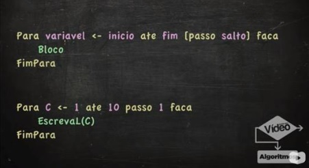

​	Permite que uma variável contadora seja testada e incrementada ou decrementada a cada iteração, sendo essas informações definidas na chamada do comando. O comando **para** recebe como entrada uma variável contadora (no exemplo da imagem, c) , a condição ( no exemplo da imagem,  de 1 até 10) e o valor de incrementação (no exemplo da imagem, passo 1). 

​	A nível de curiosidade o para é utilizado nas linguagens de programação por seu nome em inglês for e entre parenteses seus três passos. Seguindo no exemplo da imagem na linguagem de programação o laço ficaria for (c = 1; c <= 10; c++).

​	Abaixo vemos outro exemplo com o para, mas agora decrementando.

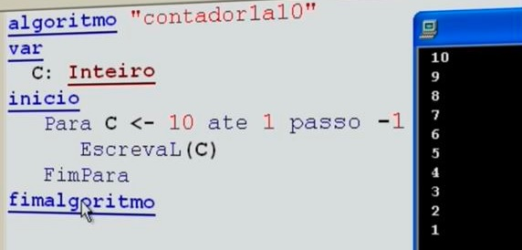

### Laço Enquanto

​	LAÇO DE REPETIÇÃO **ENQUANTO**: utilizada geralmente quando**não soubermos a quantidade de repetições** no exercício, porém é possível utilizá-la sabendo da quantidade de repetições. É necessário criar uma variável de controle que faça parar o laço, pois caso contrário o exercício entra em looping infinito. No visualG caso entre em **looping infinito** é possível **parar** através da tecla **Ctrl+F2**.

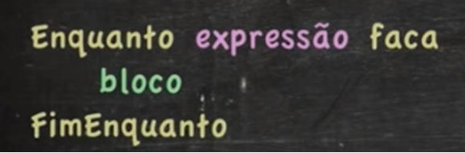

### Laço Repita... Até (Faça... Enquanto)

​	LAÇO DE REPETIÇÃO **FAÇA ENQUANTO**: Muito parecida com o laço de repetição enquanto porém a diferença é que a expressão será testada no final, **entrando no laço pelo menos uma vez**. 

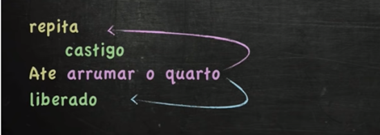

​	No **visualg**  iniciamos o laço faça enquanto com a palavra **repita**, escreve o código que será repetido, e finalizar com **até seguido pela expressão que irá parar o código**. No exemplo fica claro o entendimento que irá se repetir o castigo até que ele arrume o quarto e só sairá do laço caso ele arrume o quarto. 

### Comparação Enquanto e Repita... Até (Faça...Enquanto)

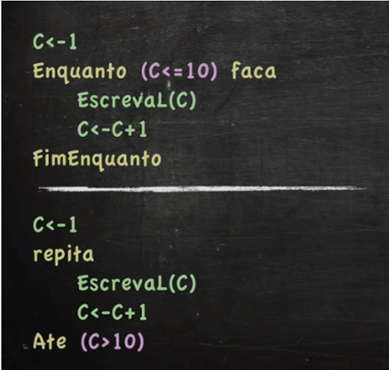

​	Para deixar bem claro o entendimento das estruturas Enquanto e Faça Enquanto irei abordar esse exercício e suas diferenças e semelhanças. Ambos foram inicializados com uma variável C recebendo 1. No exercício superior foi utilizada a estrutura enquanto, sendo assim, enquanto a variável C for menor ou igual a 10 ele executará o que está em verde, que é escrever a variável C e adicionando 1 a própria variável. Funcionando assim: verificou se a variável é menor que 10, VERDADEIRO (variável é 1), escreve 1 e adiciona mais 1, agora sendo 2, volta para o laço verifica se é menor que 10, VERDADEIRO (variável é 2), escreve 2 e adiciona mais 1, agora sendo 3, e repetindo até chegar ao número 10. No Faça Enquanto será quase a mesma lógica porém ele testa só no final, ou seja, já começa exibindo o número 1, depois adiciona mais 1, passando a valer 2, e aí ele testa, **IMPORTANTE NO VISUALG:** o teste da expressão faça enquanto no visualg é com a lógica **repita... até**, portanto é o **inverso da condição enquanto**, pois no **faça enquanto** só irá **parar o laço quando a expressão de teste for VERDADEIRA**, ou seja, 2 > 10, FALSO, então continua o laço até que chegue ao número 11 sendo a expressão 11 > 10 VERDADEIRA e aí saí do laço de repetição. Outra observação o FAÇA ENQUANTO é bom ser utilizado quando tivermos certeza que o código irá entrar pelo menos uma vez, pois caso eu inicialize a variável C recebendo 11 na estrutura faça enquanto iria escrever o número 11, adicionar + 1, passando a valer 12 e aí verificando que 12 > 10 e saindo do laço. **DICA PARA VIDA:** Fiquem atentos as diferenças de cada laço de repetição para saber aproveitar o seu código da melhor forma. 

## Vetores

​	O vetor é uma **variável composta** por mais de uma valor de um **mesmo tipo **(inteiro, real, caractere, etc). Ao invés de declararmos 4 variavéis (n1, n2, n3, n4), podemos declarar o vetor que é apenas uma variável que guarda mais de um valor e é extremamente útil nas linguagens de programação. Para a declaração é necessário informar o nome da variável, como exemplo na imagem, n (nome da variável), informar que é um vetor e seu comprimento de índice 1 até 4 [1..4], conforme o exemplo e o tipo desse vetor (inteiro, real, caractere, etc). Pode ser utilizada por atribuição igual a imagem (n[1] <- 3, significa que n no índice 1 recebe o valor 3).

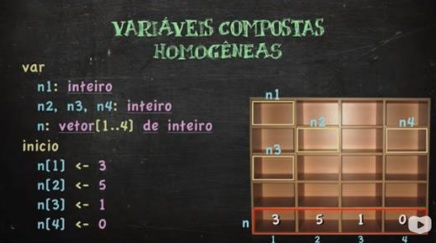

Ou com uma estrutura de repetição para (mais comum, igual na imagem abaixo em que para cada índice de 1 a 4 irá receber um valor digitado pelo usuário através do comando leia n[i] e irá guardar nesse vetor chamado n), evitando assim um código muito extenso. 

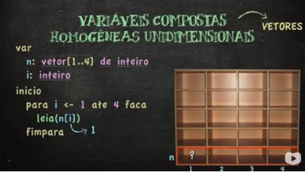

## Matriz

​	A matriz é uma **variável composta multidimensional** , ou seja, composta por duas ou mais dimensões de um **mesmo tipo **(inteiro, real, caractere, etc).

​	Como podemos visualizar na imagem abaixo é declarado um vetor chamado m com 3 linhas e 2 colunas do tipo inteiro. Abaixo foi atribuído a matriz m na posição 1 da linha e na posição 2 da coluna o valor 4,  na posição 2 da linha e na posição 2 da coluna o valor 5 e na posição 3 da linha e na posição 1 da coluna o valor 8. Essa seria uma forma de atribuir valores a matriz porém menos usual.

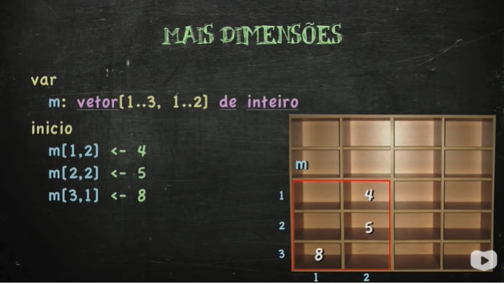

​	

​	O padrão mais utilizado para preenchimento e varredura de uma matriz é por laços de repetição, pois dessa forma conseguimos varrer e preencher toda a matriz. No exemplo abaixo foi utilizado um laço para preencher a matriz de 3 linhas e 2 colunas, sendo declarado duas variáveis de controle l (para linhas da matriz) e c (para as colunas da matriz). Dentro dos laços foi colocado um leia para o usuário preencher os valores em cada posição.  Então na primeira rodada o l será igual a 1 e o c será igual a 1, preenchendo o campo m[1,1] (matriz linha 1, coluna 1), na segunda rodada a linha continua valendo 1 e ele acrescenta mais 1 no laço interno da coluna, valendo agora 2 e preenchendo o campo m[1,2]. Como foi acessado todos os campos da coluna, sobe para o laço da linha e acrescenta mais 1 a linha, valendo agora 2 para linha e 1 para coluna, preenchendo m[2,1]. E assim consecutivamente até ter preenchido todos os espaços da matriz. 

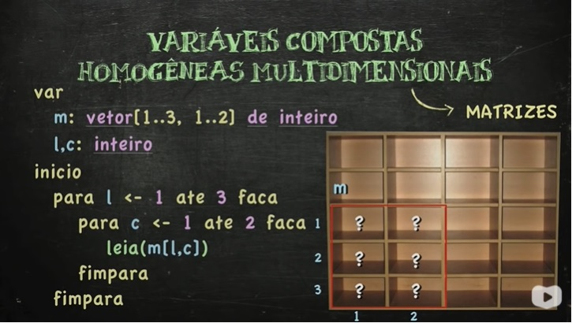

​	Importante informar que caso queira mostrar ao final a matriz preenchida, precisará varrer a matriz com dois laços novamente e inserir dentro do laço o escreva (m[l,c]). Para que seja exibido na tela em formato de matriz é necessário colocar um escreval( ) entre um fimpara e outro fimpara.

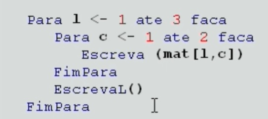

# Conclusão

​	Dessa forma finalizo minhas dicas de algoritmo e lógica de programação. Espero que esse conteúdo ajude as pessoas a compreender a importância de entender a base para depois ir avançando nas linguagens de programação, pois quando entendemos o essencial conseguimos evoluir para os demais aprendizados sem penar tanto durante a jornada. Uma dica final valiosa é para vocês tentarem entender a lógica e como o computador processa os códigos e as estruturas pois dessa forma conseguimos raciocinar um código e debugar com mais facilidade. Pratiquem muito, pois só conseguimos sermos bons em algo se praticarmos diariamente. Bons estudos a todos e para cima pessoal! 

